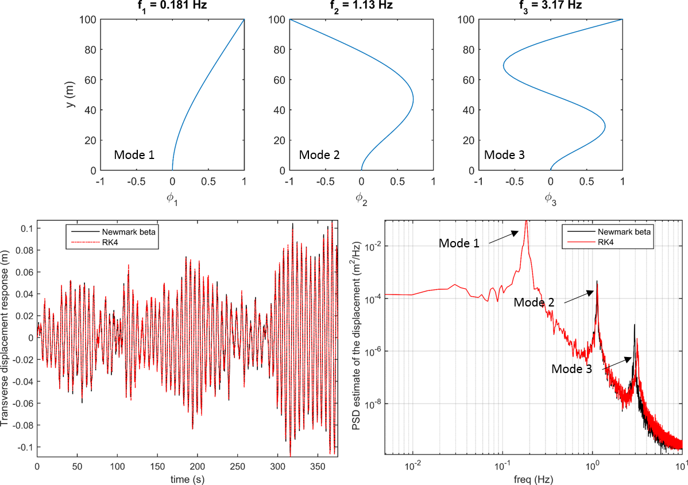

# dynaResp_beam_TD
The dynamic displacement response of a line-like structure to an uncorrelated Gaussian white noise input is computed in the time domain.

## Content

The submission contains:

- the function dynaResp_TD that computes the time history of the displacement response of a line-like structure to a given load.

- The function eigenModes.m used here to compute the mode shapes and eigenfrequency of a cantilever beam

- The file bridgeModalProperties.mat that loads the mode-shapes and eigenfrequency of a single span suspension bridge.

- 2 example files Example1.mlx and Example2.mlx

To keep the analysis as simple as possible, the structure has only one type of motion. No modal coupling is introduced and no added mass, stiffness or damping is included.

Any comments, suggestion or question is welcomed.

## Illustration

